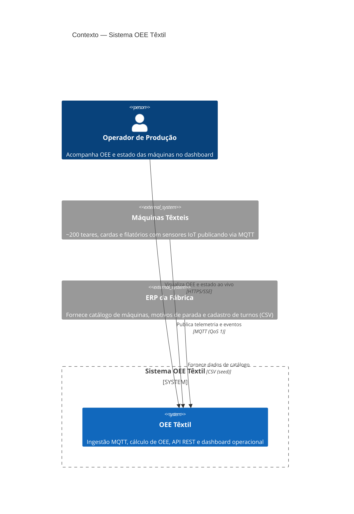
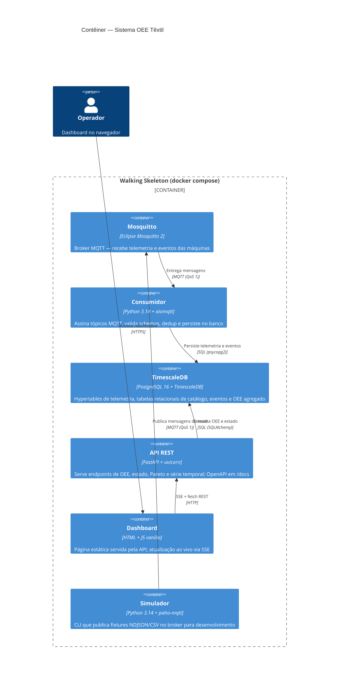

# Arquitetura — OEE Têxtil

> Documento de arquitetura do _walking skeleton_ para a **Malharia Contínua S.A.**
> (3 galpões, ~200 máquinas, 3 turnos). Parte do Desafio Técnico — Desenvolvedor(a)
> Pleno Full Stack.

## 1. Visão geral

### 1.1 Estilo arquitetural

**Event-Driven + Modular Monolith.** Um único pacote Python (`oee_textil`), uma
imagem Docker, múltiplos entry points especializados (consumidor, API, simulador,
seed). A comunicação interna é síncrona (chamadas de função); a comunicação externa
é assíncrona via **MQTT** (telemetria e eventos das máquinas) e **SSE** (stream
do dashboard).

A decisão por monorepo/monolith único está documentada em
[ADR-001](adr/001-monorepo-um-pacote-n-entry-points.md). Em resumo: o escopo do
_walking skeleton_ (~200 máquinas, 1 fábrica, 3 turnos) não justifica a
complexidade operacional de microsserviços; a modularização interna (schemas,
models, services, routes) preserva a opção de extrair serviços no futuro.

### 1.2 Princípios

| Princípio | Como aplicamos |
|-----------|---------------|
| **Contracts-first** | Os 4 schemas MQTT (`telemetria.v1`, `estado.v1`, `parada.v1`, `producao.v1`) são modelos Pydantic versionados, exportados como JSON Schema para `docs/contracts/` |
| **OEE correto por definição** | OEE = Disponibilidade × Performance × Qualidade (produto, nunca média); fatores clampados em [0,1] |
| **Resiliência na borda** | Idempotência (content hash + ON CONFLICT), dead-letter para mensagens inválidas, healthchecks em todos os serviços |
| **Harness antes de domínio** | ruff + mypy + pytest configurados antes de qualquer código de negócio (Fase 0) |
| **Decisão escrita** | Toda escolha de stack, padrão ou trade-off está justificada em ADR, DECISOES.md ou TRADEOFFS.md |

---

## 2. Diagramas C4

### 2.1 C4 — Contexto



### 2.2 C4 — Contêiner



---

## 3. Fluxo de dados

```
Máquinas (sensores)                Simulador (dev)
        │                                │
        │ MQTT (QoS 1)                   │ MQTT (QoS 1)
        ▼                                ▼
┌─────────────────────────────────────────────────┐
│              Mosquitto (broker MQTT)             │
│  tópicos: fabrica/{galpao}/{linha}/{maquina}/... │
└───────────────────────┬─────────────────────────┘
                        │ subscribe
                        ▼
┌─────────────────────────────────────────────────┐
│           Consumidor (aiomqtt + Pydantic)        │
│                                                   │
│  1. Valida schema (telemetria|estado|parada|      │
│     producao).v1 contra JSON Schema               │
│  2. Calcula content_hash (SHA-256)                │
│  3. ON CONFLICT DO NOTHING (dedup)                │
│  4. Se inválido → dead-letter (NDJSON)            │
└───────────────────────┬─────────────────────────┘
                        │ INSERT
                        ▼
┌─────────────────────────────────────────────────┐
│          TimescaleDB (PostgreSQL 16)              │
│                                                   │
│  hypertables: telemetria (partição por ts_sensor) │
│  tabelas: maquinas, motivos_parada, turnos,       │
│           estado_maquina, parada, producao,       │
│           oee_agregado                             │
└───────────────────────┬─────────────────────────┘
                        │ SELECT
                        ▼
┌─────────────────────────────────────────────────┐
│            API REST (FastAPI + uvicorn)           │
│                                                   │
│  GET /api/v1/oee/atual        OEE em tempo real  │
│  GET /api/v1/estado           estado máquinas     │
│  GET /api/v1/paradas/pareto   Pareto de paradas   │
│  GET /api/v1/oee/serie        série temporal      │
│  GET /api/v1/stream           SSE (estado + OEE)  │
└───────────────────────┬─────────────────────────┘
                        │ SSE + JSON
                        ▼
┌─────────────────────────────────────────────────┐
│         Dashboard (HTML + JS vanilla)             │
│                                                   │
│  4 cards: OEE atual, estado, Pareto, feed         │
│  Atualização ao vivo via EventSource (2s)         │
└─────────────────────────────────────────────────┘
```

---

## 4. _Bounded contexts_

| Contexto | Responsabilidade | Módulo |
|----------|-----------------|--------|
| **Ingestão** | Receber mensagens MQTT, validar schemas, dedup, persistir, dead-letter | `services/consumidor.py` |
| **Catálogo** | Máquinas, motivos de parada, turnos — dados de referência carregados via seed | `models/maquina.py`, `models/motivo_parada.py`, `models/turno.py` |
| **OEE** | Cálculo de Disponibilidade, Performance, Qualidade e OEE por máquina×janela | `services/oee.py` (funções puras) + `models/oee_agregado.py` |
| **Dashboard** | Exposição de OEE e estado via REST + SSE; página HTML estática | `routes/` (api, stream) + `static/` |
| **Simulação** | Geração de tráfego MQTT a partir de fixtures para desenvolvimento | `simulador.py` |

---

## 5. Decisões-chave

| Decisão | ADR | Resumo |
|----------|-----|--------|
| Monorepo + Modular Monolith | [ADR-001](adr/001-monorepo-um-pacote-n-entry-points.md) | Um pacote, uma imagem, múltiplos entry points |
| Schemas versionados com evolução aditiva | [ADR-002](adr/002-versionamento-schema-evolucao-aditiva.md) | Campo `schema` como discriminator; Pydantic + JSON Schema |
| Modelagem raw-first com hypertables | [ADR-003](adr/003-modelagem-dados-raw-first-hypertable.md) | Telemetria bruta + TimescaleDB hypertable |
| Idempotência, ordenação e backpressure | [ADR-004](adr/004-idempotencia-ordenacao-backpressure.md) | Content hash, ON CONFLICT, dead-letter NDJSON |
| Janelas de agregação e late events | [ADR-005](adr/005-janelas-agregacao-late-events.md) | Janela aberta para fixtures, late events documentados |
| Design da API REST | [ADR-006](adr/006-design-api-rest-fastapi.md) | FastAPI, 5 endpoints, OpenAPI, TestClient |
| SSE vs WebSocket/polling | [ADR-007](adr/007-sse-vs-websocket-polling.md) | SSE para stream unidirecional com reconexão automática |
| CI/CD com GitHub Actions | [ADR-008](adr/008-ci-cd-github-actions.md) | Pipeline lint → typecheck → test → build-and-smoke |
| Estratégia de nuvem AWS | [ADR-009](adr/009-estrategia-nuvem-aws.md) | IoT Core, ECS Fargate, RDS PostgreSQL + TimescaleDB, CloudWatch |

---

## 6. Glossário OEE

| Termo | Definição | Fórmula |
|-------|-----------|---------|
| **OEE** | Overall Equipment Effectiveness — indicador global de eficiência | D × P × Q |
| **Disponibilidade (D)** | Proporção do tempo planejado em que a máquina esteve rodando | Tempo Rodando ÷ (Tempo Planejado − Paradas Planejadas) |
| **Performance (P)** | Velocidade real vs. velocidade ideal | (Tempo de Ciclo Ideal × Total Produzido) ÷ Tempo Rodando |
| **Qualidade (Q)** | Proporção de unidades boas sobre o total produzido | (Produzidas − Refugo) ÷ Produzidas |
| **Parada planejada** | Parada programada (setup, manutenção preventiva) — descuenta do denominador de D |
| **Parada não planejada** | Parada por falha (quebra, falta de insumo) — desconta do numerador de D |
| **Tempo de ciclo ideal** | Tempo teórico mínimo para produzir 1 unidade naquela máquina |
| **Refugo** | Unidades produzidas com defeito, descartadas |
| **Turno** | Período de trabalho (A: 06h-14h, B: 14h-22h, C: 22h-06h) |
