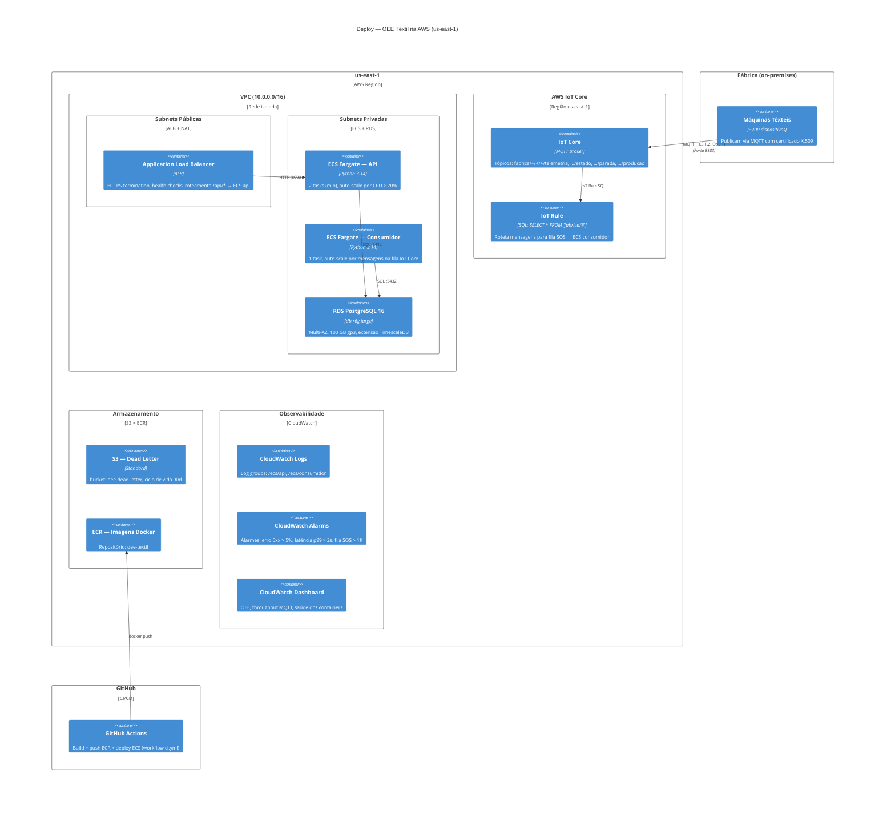

# ADR-009: Estratégia de nuvem — AWS

- **Status:** Aceito
- **Data:** 2026-08-01
- **Decisores:** Samuel Oliveira

## Contexto

O _walking skeleton_ roda integralmente em Docker Compose local (Mosquitto
self-hosted, TimescaleDB em container, API e consumidor como processos Python).
Para produção na **Malharia Contínua S.A.** (~200 máquinas, podendo escalar para
1.000+), é necessário um design de deploy em nuvem que:

- Substitua componentes self-hosted por **gerenciados** (reduzindo carga
  operacional de patching, backup, HA)
- **Escale** com o número de máquinas e a granularidade de telemetria
  (hoje 1-5s, podendo chegar a 1s)
- Seja **observável** (logs centralizados, métricas de OEE em tempo real,
  alertas de falha no pipeline)
- Tenha **custo previsível** e compatível com o orçamento de TI de uma fábrica
  têxtil de médio porte

Restrições:
- O time é pequeno (2-3 devs) — soluções _serverless_ ou totalmente gerenciadas
  têm prioridade sobre self-managed
- O repositório já está no GitHub — CI/CD com GitHub Actions é mantido
- A stack de código (Python, FastAPI, SQLAlchemy) **não muda** — o deploy na
  nuvem empacota a mesma imagem Docker

## Decisão

**Usar AWS como provedor de nuvem, com a seguinte composição de serviços
gerenciados:**

| Componente local (dev) | Componente AWS (produção) | Justificativa |
|------------------------|--------------------------|---------------|
| Eclipse Mosquitto | **AWS IoT Core** | MQTT totalmente gerenciado: escala automática, TLS mutual auth, integração nativa com regras de roteamento (IoT Rule → S3/Kinesis) |
| Python Consumidor (container) | **ECS Fargate** (task `consumidor`) | Container serverless: sem gestão de nós EC2, escala por número de mensagens na fila |
| Python API (container) | **ECS Fargate** (task `api`) | Mesmo runtime do consumidor; exposto via ALB |
| PostgreSQL + TimescaleDB | **RDS PostgreSQL 16** com extensão TimescaleDB | Banco gerenciado: backups automáticos, Multi-AZ para HA, mesma engine e schemas do dev |
| Dashboard HTML | Servido pela API (mesma task ECS) + **CloudFront** opcional para cache estático | Sem dependência extra; a API já serve os assets estáticos |
| Dead-letter NDJSON local | **S3** (bucket `oee-dead-letter`) | Durabilidade 99.999999999%, versionamento, política de ciclo de vida (expira após 90 dias) |
| Healthcheck do compose | **CloudWatch Alarms** + **Route 53 Health Checks** | Métricas de heartbeat, latência e taxa de erro |
| Logs locais (stdout) | **CloudWatch Logs** | Coleta automática do ECS; retention configurável |
| Segredos (.env) | **Secrets Manager** ou **SSM Parameter Store** | Rotação automática, audit trail via CloudTrail |

**Diagrama C4 — Deploy (AWS):**

## Alternativas consideradas

| Alternativa | Prós | Contras | Por que não |
|-------------|------|---------|-------------|
| **GCP** (Cloud IoT Core + Cloud Run + Cloud SQL) | Cloud Run mais simples que ECS, Cloud SQL com PG nativo | IoT Core foi **deprecated** em 2023; Pub/Sub não é MQTT nativo | Sem suporte oficial a MQTT — exigiria bridge ou protocol adapter |
| **Azure** (IoT Hub + Container Apps + PostgreSQL Flexible) | IoT Hub maduro, integração com Active Directory | Ecossistema menos familiar, custo mais alto para PG + timescale | Curva de aprendizado maior; comunidade menor para o stack Python+MQTT |
| **AWS Lambda** (em vez de ECS Fargate) | Escala a zero, sem gestão de container | Timeout 15 min (insuficiente para consumidor long-running), cold start, custo imprevisível em carga contínua | O consumidor é um subscriber MQTT persistente — não é workload de função efêmera |
| **Amazon Timestream** (em vez de RDS PostgreSQL) | Serverless, propósito-específico para time-series | Sem FK, sem joins, sem extensões PostgreSQL, vendor lock-in extremo | O modelo de dados tem núcleo relacional forte (catálogo, motivos, turnos) que o Timestream não resolve |
| **EKS (Kubernetes)** (em vez de ECS Fargate) | Orquestração completa, ecossistema Helm/Argo | Gestão de nós ou Fargate profile, complexidade de YAML e operação | 2-3 serviços não justificam K8s; ECS é o "K8s sem o barulho" |

## Consequências

- **Positivas:**
  - **Zero gestão de broker**: IoT Core elimina patching, escala e HA do Mosquitto.
  - **Mesmo modelo de dados**: RDS PostgreSQL com TimescaleDB é drop-in
    replacement do banco local — migrations e queries não mudam.
  - **Containers sem servidores**: ECS Fargate remove a camada de EC2;
    escala baseada em métricas da aplicação (CPU, fila SQS).
  - **Observabilidade integrada**: CloudWatch Logs/Métricas sem agent externo;
    Container Insights para visibilidade de performance.
  - **CI/CD mantido**: GitHub Actions faz build da imagem, push para ECR e
    `aws ecs update-service` — mesmo workflow `ci.yml`.

- **Negativas / dívidas assumidas:**
  - **Custo mensal estimado**: ~$400-600/mês (RDS Multi-AZ db.r6g.large
    ~$350 + ECS Fargate ~$100 + IoT Core ~$30 + ALB ~$30 + S3/CloudWatch
    ~$30). Valor de referência para ~200 máquinas com telemetria a cada 5s.
  - **Vendor lock-in**: IoT Core e ECS são proprietários AWS. Migrar para
    outro provedor exigiria reescrever a camada de infraestrutura.
  - **Cold start do Fargate**: Primeiro deploy ou scale-out tem latência
    de ~30-60s para provisionar a task.
  - **IoT Core limite de regras**: 100 rules por conta; reavaliar se
    precisar de roteamento mais granular que `fabrica/#`.

- **Como reavaliar no futuro:**
  - Se o custo do RDS crescer acima do esperado, migrar para Aurora
    PostgreSQL Serverless (escala automática com custo por uso).
  - Se o throughput de MQTT ultrapassar 10K msg/s, avaliar particionamento
    de regras IoT Core ou migração para Kinesis Data Streams.
  - Se o time crescer para >5 devs, reavaliar ECS vs EKS (Kubernetes).
